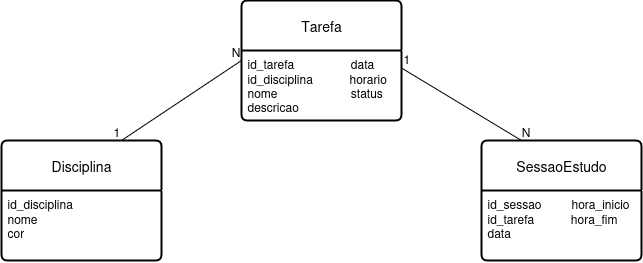

# Agenda de Estudos

Aplicativo móvel para organizar horários de estudo, gerenciar matérias e acompanhar tarefas relacionadas às disciplinas. Desenvolvido em React Native com Expo.

## Sobre o Agenda de Estudos

O **Agenda de Estudos** é um aplicativo desenvolvido para auxiliar estudantes na **organização dos estudos**, permitindo gerenciar disciplinas, sessões de estudo e tarefas de forma prática e visual.  
O objetivo é facilitar o planejamento diário e o acompanhamento das atividades acadêmicas.

### Funcionalidades

#### Funcionalidades básicas (prioritárias)
- [x] Cadastro de disciplinas
- [x] Criação de sessões de estudo (data, início, fim)
- [ ] Edição de sessões de estudo
- [ ] Exclusão de sessões de estudo
- [x] Lista de tarefas por disciplina (CRUD parcial: criação e visualização)
- [x] Visualização da agenda do dia

#### Funcionalidades adicionais (trabalhos futuros)
- [ ] Notificações locais para início de sessão
- [ ] Integração com Google Calendar
- [ ] Estatísticas de tempo estudado por disciplina

## Protótipos de Telas

Protótipos criados no **Figma** para o Agenda de Estudos.  
As telas principais são: **Welcome**, **Dashboard (Agenda do Dia)**, **Tela de Disciplina**, **Adicionar Tarefa** e **Tarefa**.

🔗 [Acessar Protótipo no Figma](https://www.figma.com/design/LKuQnGxH2fDFO82WdcmvsM/App-agenda-estudos?node-id=0-1&t=gyZAggg9zXbUsFWE-1)

- **Dados mais realistas nas telas:**  
  - Nome de tarefas: “Resolver lista de exercícios”  
  - Disciplinas: “Matemática”, “Português”, “Química”  
  - Descrição: “Resolver exercícios do capítulo 5 sobre funções”  
  - Tags/cores da tarefa visualizadas com seletor de cores (azul, vermelho, verde)  

---

## Modelagem do Banco (SQLite local)

O banco será **SQLite local** no celular para protótipo, substituindo o MySQL remoto inicialmente.  

**Entidades principais:**

- **Users**  
  - `id` (PK, AUTO_INCREMENT)  
  - `name` (VARCHAR, obrigatório)  
  - `email` (VARCHAR, obrigatório)  

- **Subjects**  
  - `id` (PK, AUTO_INCREMENT)  
  - `name` (VARCHAR, obrigatório)  
  - `color` (VARCHAR, opcional, para identificar visualmente a disciplina)  
  - `user_id` (FK para Users)  

- **Tasks**  
  - `id` (PK, AUTO_INCREMENT)  
  - `subject_id` (FK para Subjects)  
  - `name` (VARCHAR, obrigatório)  
  - `description` (TEXT, opcional)  
  - `date` (DATE)  
  - `time` (TIME)  
  - `status` (ENUM: 'pending', 'done', padrão 'pending')  
  - `color` (VARCHAR, opcional)  

- **StudySessions**  
  - `id` (PK, AUTO_INCREMENT)  
  - `subject_id` (FK para Subjects)  
  - `name` (VARCHAR, obrigatório)  
  - `date` (DATE)  
  - `start_time` (TIME)  
  - `end_time` (TIME)  

### Diagrama ER

Diagrama exportado do draw.io mostrando as tabelas e seus relacionamentos:

---

## Planejamento de Sprints (3 pts)

| Sprint   | Período   | Atividades planejadas |
|----------|-----------|---------------------|
| Sprint 1 | Semana 1  | - Configuração do repositório e ambiente Expo/React Native - Criação do README inicial - Protótipo das telas principais no Figma - Modelagem do banco de dados (SQLite) e diagrama ER |
| Sprint 2 | Semana 2  | - Implementação do CRUD de disciplinas ✅ - Desenvolvimento da tela de Dashboard (agenda do dia) ✅ - Criação da navegação entre telas principais ✅ |
| Sprint 3 | Semana 3  | - Implementação do CRUD de sessões de estudo - Conexão das sessões de estudo com o banco ✅ (SQLite local) - Testes iniciais das telas de disciplinas e sessões |
| Sprint 4 | Semana 4  | - Implementação do CRUD de tarefas por disciplina - Funcionalidade de marcar tarefas como pendentes/concluídas - Testes das funcionalidades de tarefas |
| Sprint 5 | Semana 5  | - Ajustes de UI/UX (cores, ícones, layouts) - Simulação de notificações locais para início de sessão - Implementação de validações e mensagens de erro nos formulários |
| Sprint 6 | Semana 6  | - Implementação de estatísticas simples de tempo estudado - Revisão completa do protótipo e funcionalidades - Testes finais e correções - Preparação para entrega e documentação final |

---

## Atualizações desde o último checkpoint

- Implementadas 3 telas principais: **Home**, **Login** e **Register**  
- **Expo Router** configurado e funcional para navegação entre telas  
- Telas estilizadas com **Styled-components** e **StyleSheet**  
- Criados e utilizados componentes reutilizáveis:  
  - `CustomInput` com validação de formulário  
  - `ButtonPrimary` para botões principais  
- Aplicadas boas práticas de componentes: tipagem em TypeScript, props claras, tratamento de erros, componentes independentes e reutilizáveis  
- Banco padronizado em inglês, usando **SQLite local** para protótipo  

🎬 **Vídeo de demonstração:** [Inserir link do vídeo aqui]  

---

## Autor
- Caroline Ferreira
